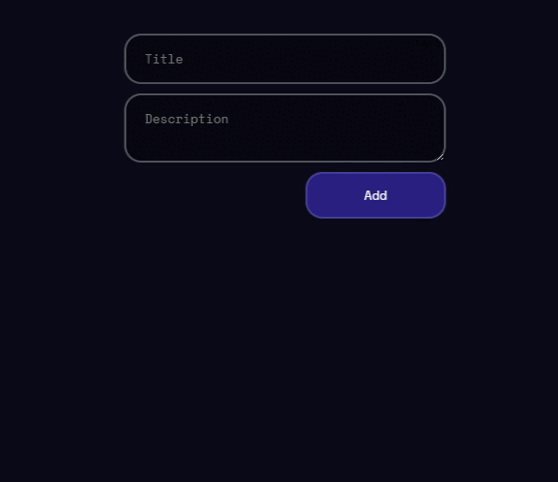

# 🌍 Project Overview

This is a frontend web application built with **React** 🚀 and bundled using **Vite** 🌟 for fast development and production builds. The project follows modern practices with a clean and modular structure.
# ⭐ Try
- [react-to-do-two-iota.vercel.app](react-to-do-two-iota.vercel.app)

# 💡 Technologies Used

- 🎨 [React](https://react.dev/)
- 🎉 [Vite](https://vitejs.dev/)
- 💄 [CSS3](https://developer.mozilla.org/en-US/docs/Web/CSS)

# 📝 Installation and Running

Follow these steps to run the project locally:

1. 🔄 **Clone or download** the project to your machine.

2. 🛀 **Navigate** into the project folder.

3. 🔢 **Install dependencies**:

   ```bash
   npm install
   ```

4. 🚀 **Start the development server**:

   ```bash
   npm run dev
   ```

5. 🌐 Open your browser and visit [http://localhost:5173](http://localhost:5173) to view the app.

# 🔧 Scripts

- `npm run dev` — Launches the development server
- `npm run build` — Creates an optimized production build
- `npm run preview` — Previews the production build locally

# 💡 Notes

- Make sure [Node.js](https://nodejs.org/) (version 16 or higher) is installed 🌱.
- The project uses the default **Vite** configuration, but you can customize `vite.config.js` if needed 📂.

# 📸 Preview

Here is a preview of the application:


